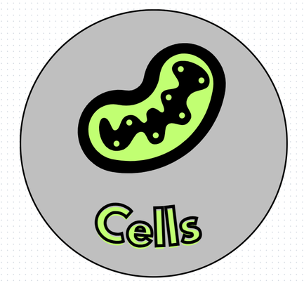

<h1 align="center">Hi There, We are  <a href="https://github.com/NRRuseva21/Cells"> Cells </a></h1>


<p align = "center">
  
</p>

<br>

## 📋 Description

  Program for 8th and 9th grade students studying biology. It is in the form of a game that will benefit students to learn essential things related to the study material in an easy and accessible and interesting way.
  
## 🚀 Languages 
  <p align="left"> 
  <a href="https://www.cplusplus.com/"></a>
 
  </p>

## 🔧 Tools 
  <p align="left"> 
  <a href="https://visualstudio.microsoft.com/"></a>
    <a href="https://www.microsoft.com/en-ww/microsoft-365/word"></a>
    <a href="https://www.microsoft.com/en-us/microsoft-365/powerpoint">
    <a href="https://www.microsoft.com/en-us/microsoft-365/excel"></a>
      <a href="https://git-scm.com/"></a>
      <a href="https://git-scm.com/"></a>
  </p> 
  
## 💼 Documents
  <ul>
    <li><a href="Documentation/Documentation.docx">Documentation</a></li>
    <li><a href="Documentation/Cells.pptx">Presentation</a></li>
   </ul>


## ⚙ Website Access

*You can access our website by pasting this link into your browser.*
```
   https://github.com/NRRuseva21/Cells
```

## 🖥 Team Members
* **Nikoleta Ruseva** - *Scrum trainer* 
* **Filipa Popova** - *Back-end developer* 
* **Kaloyan Georgiev** - *Back-end developer* 
* **Steliyan Nikolov** - *Front-end developer*  
